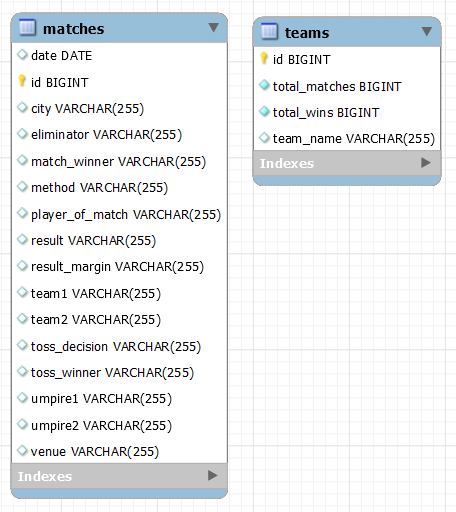

# IPL Dashboard

Spring Boot dependencies :
- Spring Batch
- Spring Web
- Spring Data JPA
- MySQL Driver

Dev dependencies :
- Spring Boot DevTools
- Lombok

### First Phase : Reading, Processing & Writing data from CSV file to MySQL database

Fields in CSV : (Input Values)

- city, date, player_of_match, venue, 
team1, team2, toss_winner, toss_decision, 
match_winner, result, result_margin, eliminator, method

Processing :

- Calculation of first innings team and second innings team using toss_winner, toss_decision, 
team1 and team2 fields.
- Extracting information of a particular team from matches table and inserting in teams table.

Database consist of 2 tables :

- matches
- teams

  

### Second Phase : Implementing Business Logic, API endpoints & Security

API endpoints:

- List of teams : 
http://localhost:8080/api/v1/teams

- Single Team : 
http://localhost:8080/api/v1/teams/{teamName}

- All matches of a team in a particular year : 
http://localhost:8080/api/v1/teams/{teamName}/matches?year={yearName}

### Third Phase : UI Pages such as HomePage, TeamPage, MatchPage